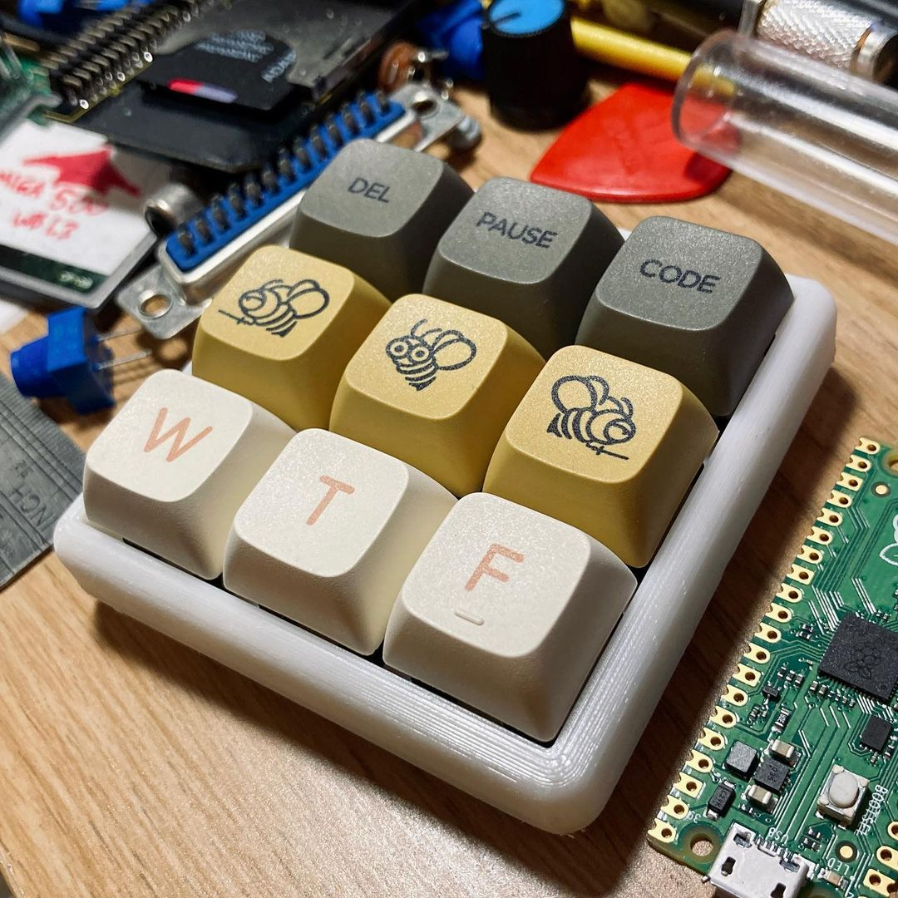

# 3x3 macro-pad thing that DOESN'T always appear as a mass storage device

Based heavily on adafruit's RPi Pico HID code examples (which are included as they're MIT licensed - hopefully that's ok), my main tweak is a custom boot.py which causes mass storage mode and USB MIDI mode to be disabled by default. 

This means an Explorer/Finder window won't pop up every time you connect it UNLESS you're holding down one of the pad's keys - in my case the first key in the 3x3 grid, connected to pin GP0.

This prevents you from being locked out, and is particularly handy for when you need to change your key mappings in code.py without having to reflash the bootloader - just hold down the first key while you replug the micro USB.

If I remember correctly, you'll need to flash the Pico with the adafruit CircuitPython firmware (which involves dragging and dropping the UF2 file onto the Pico's mass storage root), then add the lib directory and contents, and the boot.py and code.py files. Stuff in boot.py won't take effect until you restart the device (unplug and plug it in again) since that script is only run once before USB modes are conditionally set.

For my pad, I used STL files from [sepro on Thingiverse](https://www.thingiverse.com/thing:4816077) which are a mashup of the VOID9 Macropad and the Pico Armour case.
  
Docs for the Adafruit HID library [here](https://circuitpython.readthedocs.io/projects/hid/en/latest/)